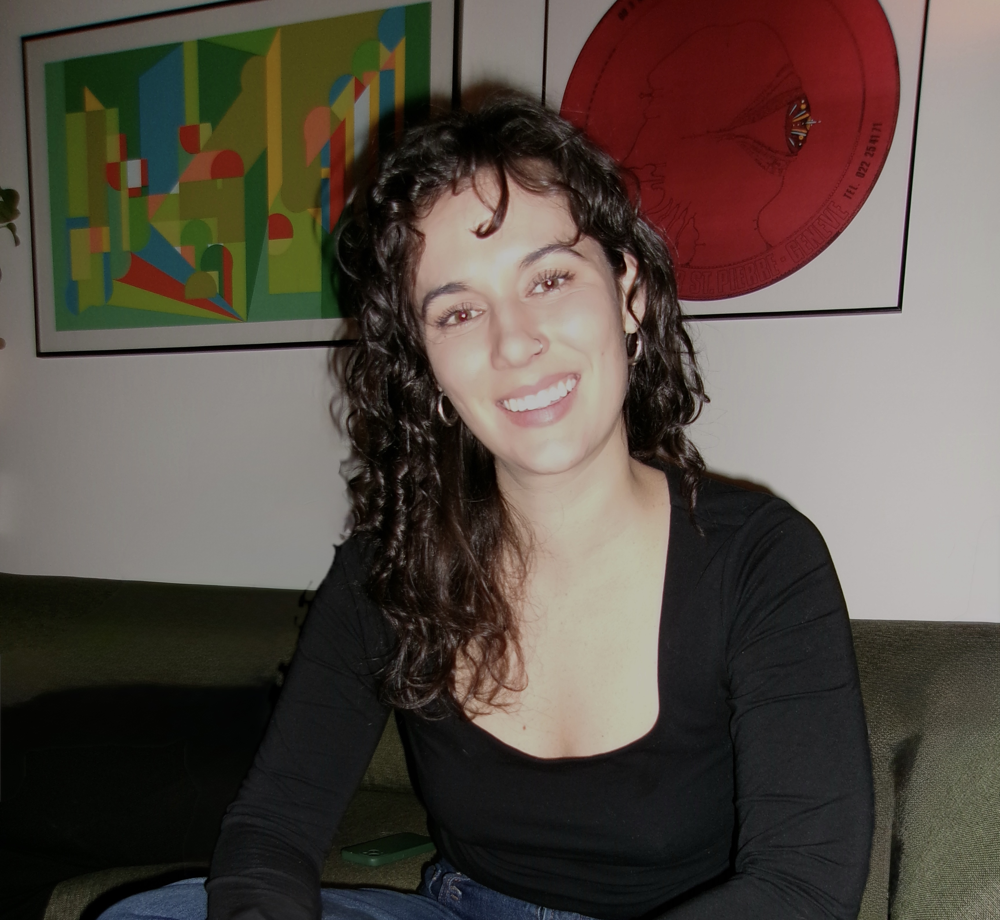

```{=html}
<div class="main-wrapper">
  <div class="content-wrapper">

    <!-- Name -->
<section class="hero-name">
  <h1 class="site-title-static">Callie Clark</h1>
</section>

<section class="hero-layout">
  <div class="hero-image-small">
    
  </div>
  <div class="hero-text">

      <!-- Blurb -->
      <div class="hero-text">
        <p>
          Callie is an Urban Systems Ph.D. Candidate at New York University’s
          Tandon School of Engineering  in the Civil & Urban Engineering Department. She is a Research Fellow at both the 
          <a href="https://engineering.nyu.edu/research/centers/cusp/">
            Center for Urban Data Science + Progress
          </a> 
          and the 
          <a href="https://marroninstitute.nyu.edu/">Marron Institute</a>
         
        </p>

        <p>
          She is co-advised by Dr. Constantine Kontokosta at the 
          <a href="https://www.urbanintelligencelab.org/">Urban Intelligence Lab</a> 
          and Dr. Takahiro Yabe at the 
          <a href="https://www.takayabe.net/">Resilient Urban Networks Lab</a>.
        </p>
      </div>

    </section>

    <!-- Main Content -->
    <section class="main-content">

      <div class="intro-box">
        <p>
          Callie’s research examines <strong>segregation in activity spaces</strong> 
          and <strong>neighborhood dynamics</strong>, with a focus on how access to 
          public infrastructure shapes the diversity of social interactions. She has 
          an ongoing project evaluating <strong>Emergency Food Access in New York City</strong> 
          using a multi-dimensional framework in collaboration with partners at City Harvest 
          and the University of Colorado Boulder.
        </p>

        <p>
          Callie earned an M.S. in Systems Engineering and a B.S. in Civil and Environmental 
          Engineering from UC Berkeley. Prior to graduate school, she worked as a data analyst 
          at Lawrence Berkeley National Laboratory in the Building Technology and Urban Systems 
          Division.
        </p>
      </div>

      <!-- Keywords -->
      <div class="keywords">
        <strong>Keywords:</strong>
        activity spaces, spatial segregation, neighborhood dynamics, public infrastructure,
        urban mobility, accessibility, social interaction, food systems, spatial data science,
        complex systems
      </div>

      <!-- Contact -->
      <div class="contact-section">
        <h3>Contact</h3>
        <p>
          Please feel free to reach out with questions or to discuss my work.
        </p>
        <p>
          Email: <a href="mailto:callieclark@nyu.edu">callieclark@nyu.edu</a><br>
          LinkedIn: <a href="https://www.linkedin.com/in/callie-clark/">linkedin.com</a>
        </p>
      </div>

    </section>

  </div>
</div>

```

```{=html}
<style>
/* Name styling */
.site-title-static {
  font-size: 3.5rem;   /* matches previous H1 scale */
  font-weight: 400;
  letter-spacing: 0.04em;
  margin-bottom: 2rem;
}

/* Flex layout: image + text side by side */
.hero-layout {
  display: flex;
  flex-direction: row;        /* horizontal layout */
  align-items: flex-start;    /* top-align text with image */
  gap: 2.5rem;                /* space between image and text */
  margin-bottom: 3rem;
}

/* Image container */
.hero-image-small {
  flex-shrink: 0;             /* prevent image from shrinking */
}

/* Circular image */
.hero-image-small img {
  width: 320px;               /* desired large size */
  height: 320px;               /* preserve aspect ratio */
  object-fit: cover;
  border-radius: 50%;         /* make circular */
  display: block;
}

/* Text block next to image */
.hero-text {
  max-width: 700px;           /* prevents overly wide text */
}

/* Responsive: stack image + text vertically on small screens */
@media (max-width: 768px) {
  .hero-layout {
    flex-direction: column;
    align-items: center;
    text-align: center;
  }

  .hero-image-small img {
    width: 200px;             /* smaller for mobile */
    height: auto;
  }

  .hero-text {
    max-width: 100%;
  }
}
</style>

```


```{=html}
<script type="text/javascript">
document.addEventListener('DOMContentLoaded', () => {
  // Animation initialization
  if (!sessionStorage.getItem('animationPlayed')) {
    const introBox = document.querySelector('.intro-box');
    introBox.classList.add('animate');
    sessionStorage.setItem('animationPlayed', 'true');
  }

  // Image Gallery class
  class ImageGallery {
    constructor(container) {
      // Your existing ImageGallery code
      this.gallery = container;
      this.figures = this.gallery.querySelectorAll('figure');
      this.nav = this.gallery.nextElementSibling;
      this.dots = this.nav.querySelectorAll('.gallery-dot');
      this.currentIndex = 0;
      
      this.showImage(0);
      this.setupEventListeners();
    }
    
    // Rest of your ImageGallery class methods
    showImage(index) {
      if (index < 0 || index >= this.figures.length) return;
      
      this.figures.forEach(fig => {
        fig.style.display = 'none';
        fig.classList.remove('active');
      });
      
      this.figures[index].style.display = 'block';
      this.figures[index].classList.add('active');
      
      this.dots.forEach(dot => dot.classList.remove('active'));
      if (this.dots[index]) {
        this.dots[index].classList.add('active');
      }
      
      this.currentIndex = index;
    }
    
    setupEventListeners() {
      this.dots.forEach((dot, index) => {
        dot.addEventListener('click', () => this.showImage(index));
      });
      
      let touchStartX = 0;
      let touchEndX = 0;
      
      this.gallery.addEventListener('touchstart', (e) => {
        touchStartX = e.touches[0].clientX;
      }, { passive: true });
      
      this.gallery.addEventListener('touchend', (e) => {
        touchEndX = e.changedTouches[0].clientX;
        const swipeDistance = touchStartX - touchEndX;
        const swipeThreshold = 50;
        
        if (Math.abs(swipeDistance) > swipeThreshold) {
          if (swipeDistance > 0 && this.currentIndex < this.figures.length - 1) {
            this.showImage(this.currentIndex + 1);
          } else if (swipeDistance < 0 && this.currentIndex > 0) {
            this.showImage(this.currentIndex - 1);
          }
        }
      }, { passive: true });
    }
  }

  // Initialize galleries
  const galleries = document.querySelectorAll('.gallery-images');
  galleries.forEach(gallery => {
    new ImageGallery(gallery);
  });
});
</script>
```

