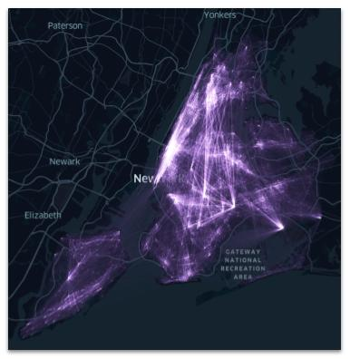
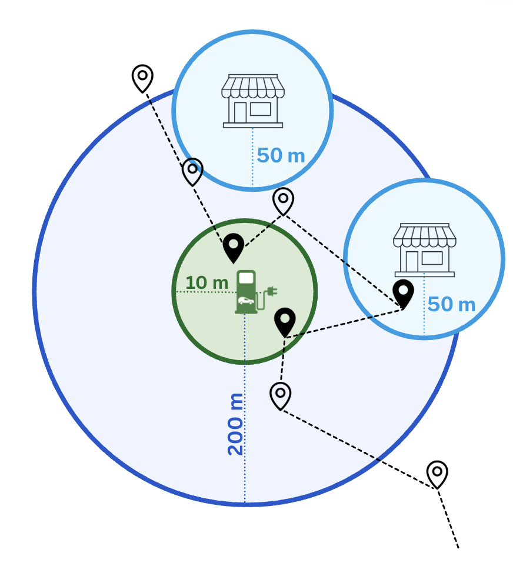
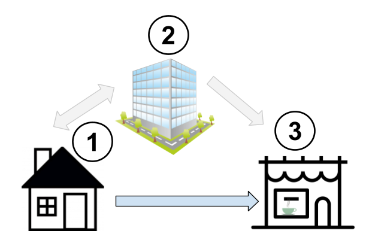
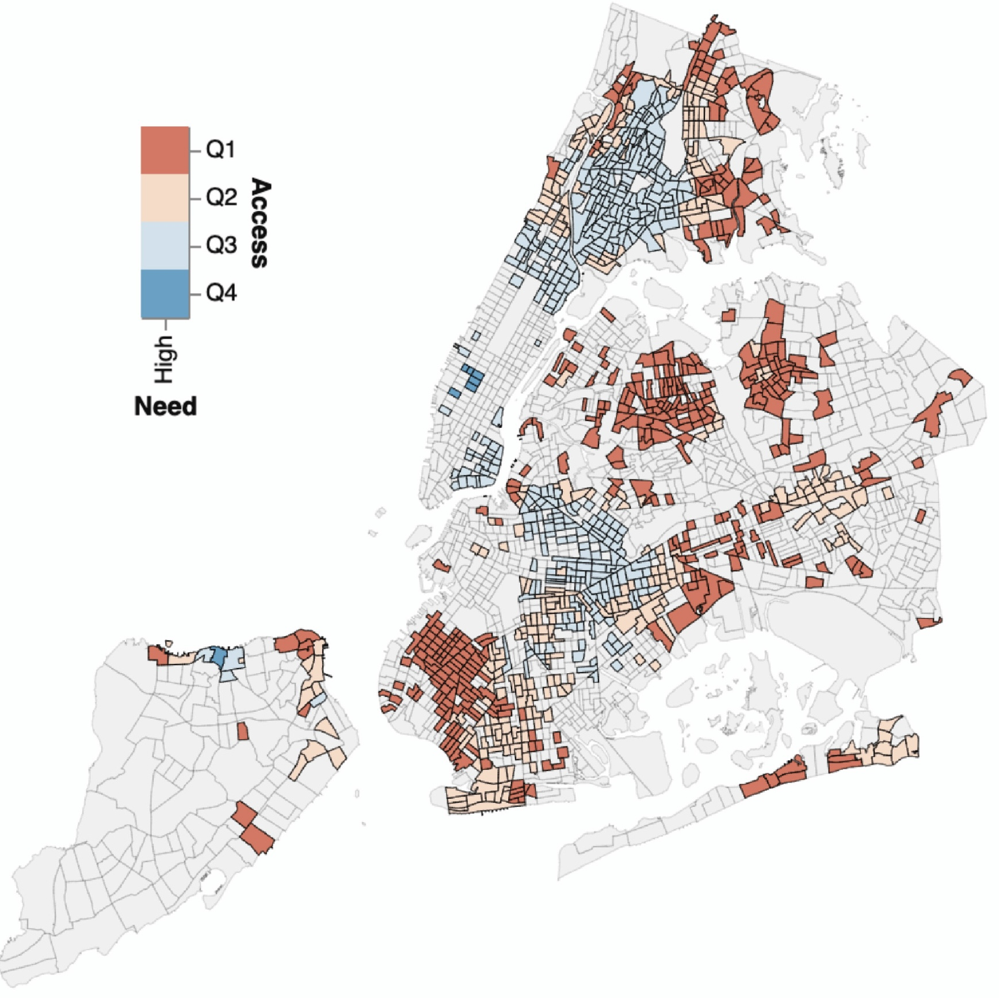
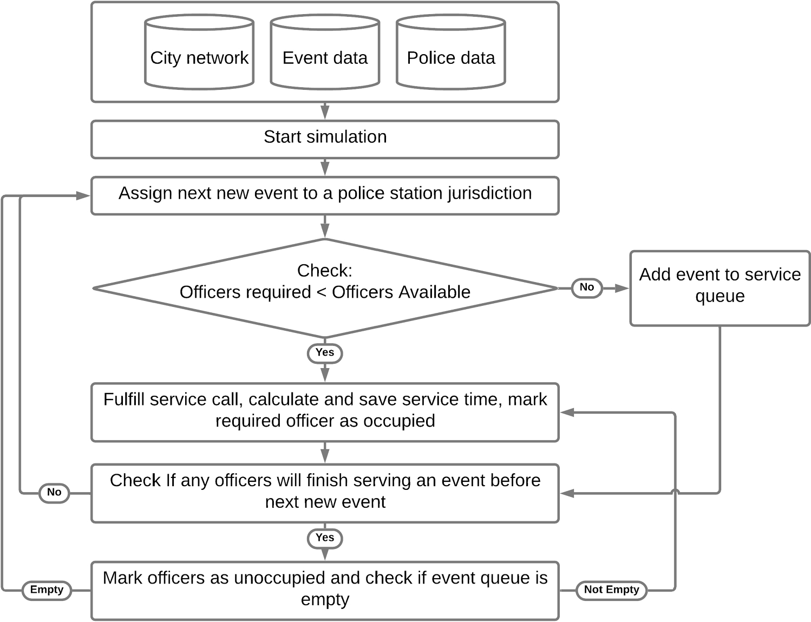

```{=html}

<style>
  .section-divider {
    width: 60%;
    margin: 20px auto;
    border: none;
    border-top: 1px solid #d3d3d3;
  }
</style>

<div class="main-wrapper">
  <div class="content-wrapper">

<section style="text-align: center; margin: 60px 0 20px 0;">
  <h1 style="font-size: 4.5rem; font-weight: 700; margin-bottom: 0;">
    Research
  </h1>
  <div style="font-size: 1.5rem; color: #aaa; letter-spacing: 0.15em; margin-top: 5px;">
    PROJECTS
  </div>
</section>

    <hr class="section-divider">

    <!-- Neighborhood Connectivity -->
    <section class="project-section" style="display: flex; gap: 30px; padding: 20px 0;">
      <div style="flex: 0 0 25%; text-align: center;">
        
      </div>

      <div style="flex: 1;">
        <h3>Neighborhood Connectivity</h3>
        <div style="color: #555; font-size: 0.9em; margin-bottom: 15px;">
          <strong>Collaborators:</strong> Bartosz Bonczak; Lance Freeman; Constantine Kontokosta
        </div>
        <p>Neighborhoods are often characterized by residential demographics, density, or the distribution of Points of Interest (POIs), yet patterns of mobility—where residents travel and who visits a neighborhood—also play a central role in shaping neighborhood character. This work leverages large-scale mobility data at the Census Block Group (CBG) level to construct neighborhood connectivity networks across 74 Metropolitan Statistical Areas (MSAs) in the United States. Using the resulting network structure, we propose a new data-driven neighborhood typology. We then integrate additional data sources—including demographic characteristics, Point of Interest (POI) locations, and LEHD employment data—to examine how neighborhood connectivity relates to underlying social, economic, and spatial characteristics.This project is apart of a larger  <a href=https://marroninstitute.nyu.edu/blog/constantine-kontokosta-awarded-nsf-grant-to-examine-interconnectedness-of-residents-from-varied-neighborhoods> NSF project</a>.   </p>
      </div>
    </section>

    <hr class="section-divider">

    <!-- Community-Centric EV Charging -->
    <section class="project-section" style="display: flex; gap: 30px; padding: 20px 0;">
      <div style="flex: 0 0 25%; text-align: center;">
        
        <div style="margin-top: 8px;">
          <a href="https://doi.org/10.48550/arXiv.2606.02848" target="_blank">[Paper]</a>
        </div>
      </div>

      <div style="flex: 1;">
        <h3>Community-Centric EV Charging</h3>
        <div style="color: #555; font-size: 0.9em; margin-bottom: 15px;">
          <strong>Collaborators:</strong>  Anne Driscoll; Xiyuan Ren; Salsabil Salah;
          Marta González; Joseph Chow; Takahiro Yabe
        </div>
        <p>
        Electric vehicle charging stations (EVCS) constitute a critical component of modern urban infrastructure, and the rate of
        installation is remaining steady. This work proposes a new method of identifying EV drivers, allowing a broader exploration of 
        their behavior and the ability to better inform optimal infrastructure placement. Prior to this work, the charging preferences 
        of EV drivers have been limited to surveys, fields studies and, analyses of 
           EVCS  and station-level charging session data . These sources are either limited by sample size and study longevity, or 
           confined to the duration of charging session event. Our study provides a new lens into understanding EV driver charging 
           behavior and it's impact on surrounding businesses— through large-scale individual mobility data. This project is apart of a larger  <a href=https://engineering.nyu.edu/news/tandon-researchers-advance-equitable-resilient-ev-charging-turbocharge-economy> NSF project</a>.   </p>
        </p>
      </div>
    </section>

    <hr class="section-divider">

    <!-- Hybrid Work -->
    <section class="project-section" style="display: flex; gap: 30px; padding: 20px 0;">
      <div style="flex: 0 0 25%; text-align: center;">
        
      </div>

      <div style="flex: 1;">
        <h3>Hybrid Work</h3>
        <div style="color: #555; font-size: 0.9em; margin-bottom: 15px;">
          <strong>Collaborators:</strong> Xiaotong Xu; Wei Ma; Takahiro Yabe
        </div>
        <p>
        
        The concept of the "third place" introduced by Ray Oldenburg, refers to public spaces distinct from the home (the first 
          place) and the workplace (the second place) that support everyday social interactions.  However, the COVID-19 pandemic
          significantly increased the adoption of remote and hybrid work in certain industries, altering the long-established
          relationship between the first (home) and second (work) place. In this study, we aim to understand how the long-term shift 
          to hybrid work culture has impacted the the use of third places in cities. We leverage
          anonymized, high-resolution mobile phone location data for 3 months in 2019 and June 2022 across eight major U.S.Metropolitan
          Statistical Areas (MSAs) to identify individual hybrid work behaviors and visits to third places. 

          
        </p>
      </div>
    </section>

    <hr class="section-divider">

    <!-- Emergency Food Access -->
    <section class="project-section" style="display: flex; gap: 30px; padding: 20px 0;">
      <div style="flex: 0 0 25%; text-align: center;">
        
        <div style="margin-top: 8px;">
          <a href="https://doi.org/10.1016/j.healthplace.2024.103319" target="_blank">[Paper]</a>
        </div>
      </div>

      <div style="flex: 1;">
        <h3>Emergency Food Access</h3>
        <div style="color: #555; font-size: 0.9em; margin-bottom: 15px;">
          <strong>Collaborators:</strong> Christa Perfit; Alice Reznickova
        </div>
        <p>
         Emergency food access is a critical component of urban resilience and public health, yet significant spatial and temporal disparities persist. This work evaluates emergency food access in New York City using a multi-dimensional framework developed in collaboration with partners at City Harvest and the University of Colorado Boulder. We simulate travel times to the nearest food pantry throughout the week across four modes of transportation—walking, biking, driving, and public transit—while incorporating pantry-specific operating hours and the underlying urban transit infrastructure. Building on these measures, we propose an Emergency Food Access Index (EFAI) to systematically identify gaps in service by highlighting areas characterized by high need and low access.
        </p>
      </div>
    </section>

    <hr class="section-divider">

    <!-- Police Response Time -->
    <section class="project-section" style="display: flex; gap: 30px; padding: 20px 0;">
      <div style="flex: 0 0 25%; text-align: center;">
        
        <div style="margin-top: 8px;">
          <a href="https://link.springer.com/article/10.1140/epjs/s11734-021-00344-1" target="_blank">[Paper]</a>
        </div>
      </div>

      <div style="flex: 1;">
        <h3>Police Response Time and Resource Reallocation</h3>
        <div style="color: #555; font-size: 0.9em; margin-bottom: 15px;">
          <strong>Collaborators:</strong> Chitra Dangwal; Dylan Kato; Marta González
        </div>
        <p>
          Police response time is a central dimension of public safety and a key consideration in debates over alternative emergency response models. This work uses spatial network analysis to examine how reductions in police staffing may affect response times in urban settings. Modeling Chicago’s transportation system as a network, we simulate police responses from stations to incident locations and evaluate the effects of reallocating certain incident types to alternative responders. Using Chicago’s large, open-source police incident response dataset, we assess how response times change under a range of staffing and incident-allocation scenarios. Our results suggest that the current response time distribution can be maintained with a 30–60% reduction in police staffing levels, provided that some incidents are redirected to non-police responders.
        </p>
      </div>
    </section>

  </div>
</div>


</section>

<!-- Delineation line --> <!-- Publications --> <section class="lab-section" style="padding-top: 20px; padding-bottom: 60px;"> <h2 style="text-align: center; font-size: 2em; margin-bottom: 30px; color: #333;"> Publications </h2> <div style="color: #444; font-size: 1.1rem; line-height: 1.7; text-align: left; max-width: 800px; margin: 0 auto;"> <div style="margin-bottom: 18px;"> <div style="margin-bottom: 18px;">
  <strong>Clark, Callie</strong>, Anne Driscoll, Xiyuan Ren, Salsabil Salah, Marta C. González, Joseph Y. J. Chow, and Takahiro Yabe. &ldquo;Using large scale GPS data to reveal EV driver activity patterns beyond charging sessions.&rdquo;
  <a href="https://doi.org/10.48550/arXiv.2606.02848">
    <em>arXiv</em>
  </a>
  (2026).
</div>De Silva, Mavin M., <strong>Callie Clark</strong>, Tadachika Nakayama, and Takahiro Yabe. “Causal spillover effects of electric vehicle charging station placement on local businesses: A staggered adoption study.” <a href="https://arxiv.org/abs/2511.19507"> <em>arXiv</em> </a> (2025). </div> <div style="margin-bottom: 18px;"> <strong>Clark, Callie</strong>, Christa Perfit, and Alice Reznickova. “A multi-dimensional access index: Exploring emergency food assistance in New York City.” <a href="https://doi.org/10.1016/j.healthplace.2024.103319"> <em>Health &amp; Place</em> </a> 89 (2024): 103319. </div> <div style="margin-bottom: 18px;"> <strong>Clark, Callie</strong>, Chhavi Dangwal, Daisuke Kato, and others. “A network spatial analysis simulating response time to calls for service at variable staffing levels.” <a href="https://link.springer.com/article/10.1140/epjs/s11734-021-00344-1"> <em>European Physical Journal Special Topics</em> </a> 231 (2022): 1645–1653. </div> </div>

```


