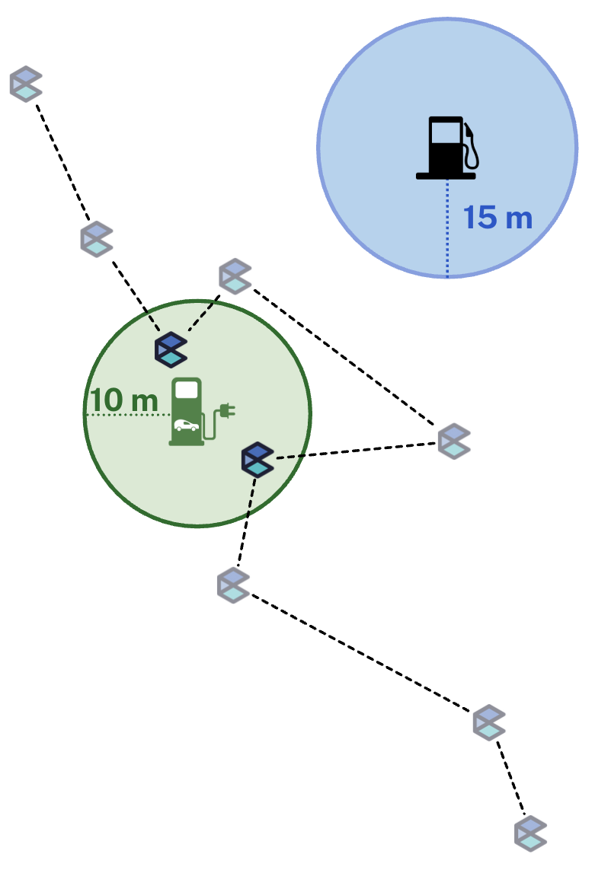

```{=html}

<style>
  .section-divider {
    width: 60%;
    margin: 40px auto;
    border: none;
    border-top: 1px solid #d3d3d3;
  }
</style>

<div class="main-wrapper">
  <div class="content-wrapper">

<section style="text-align: center; margin: 60px 0 40px 0;">
  <h1 style="font-size: 4.5rem; font-weight: 700; margin-bottom: 0;">
    Research
  </h1>
  <div style="font-size: 1.5rem; color: #aaa; letter-spacing: 0.15em; margin-top: 5px;">
    PROJECTS
  </div>
</section>

    <hr class="section-divider">

    <!-- Neighborhood Connectivity -->
    <section class="project-section" style="display: flex; gap: 30px; padding: 40px 0;">
      <div style="flex: 0 0 25%; text-align: center;">
        
      </div>

      <div style="flex: 1;">
        <h3>Neighborhood Connectivity</h3>
        <div style="color: #555; font-size: 0.9em; margin-bottom: 15px;">
          <strong>Collaborators:</strong> Bartosz Bonczak; Lance Freeman; Constantine Kontokosta
        </div>
        <p> We use large-scale mobility data at the Census Block Group (CBG) level to construct neighborhood connectivity networks for 74 MSAs across the U.S. We then use the network structure to propose a new neighborhood typology. Then we pull in a variety of other data, including: demographic data , Point of Interest (POI) locations, LEHD data, to explore the relationship between the network structure and the neighborhood characteristics.  This project is apart of a larger  <a href=https://marroninstitute.nyu.edu/blog/constantine-kontokosta-awarded-nsf-grant-to-examine-interconnectedness-of-residents-from-varied-neighborhoods> NSF project</a>.   </p>
      </div>
    </section>

    <hr class="section-divider">

    <!-- Community-Centric EV Charging -->
    <section class="project-section" style="display: flex; gap: 30px; padding: 40px 0;">
      <div style="flex: 0 0 25%; text-align: center;">
        
        <div style="margin-top: 8px;">
          <a href="https://arxiv.org/abs/2511.19507" target="_blank">[Paper]</a>
        </div>
      </div>

      <div style="flex: 1;">
        <h3>Community-Centric EV Charging</h3>
        <div style="color: #555; font-size: 0.9em; margin-bottom: 15px;">
          <strong>Collaborators:</strong> Mavin De Silva; Anne Driscoll; Xiyuan Ren; Salsabil Salah;
          Marta Gonzalez; Joseph Chow; Takahiro Yabe
        </div>
        <p>
        Electric vehicle charging stations (EVCS) constitute a critical component of modern urban infrastructure, and the rate of
        installation is remaining steady. This work proposes a new method of identifying EV drivers, allowing a broader exploration of 
        their behavior and the ability to better inform optimal infrastructure placement. Prior to this work, the charging preferences 
        of EV drivers have been limited to surveys, fields studies and, analyses of 
           EVCS  and station-level charging session data . These sources are either limited by sample size and study longevity, or 
           confined to the duration of charging session event. Our study provides a new lens into understanding EV driver charging 
           behavior and it's impact on surrounding businesses— through large-scale individual mobility data. This project is apart of a larger  <a href=https://engineering.nyu.edu/news/tandon-researchers-advance-equitable-resilient-ev-charging-turbocharge-economy> NSF project</a>.   </p>
        </p>
      </div>
    </section>

    <hr class="section-divider">

    <!-- Hybrid Work -->
    <section class="project-section" style="display: flex; gap: 30px; padding: 40px 0;">
      <div style="flex: 0 0 25%; text-align: center;">
        
      </div>

      <div style="flex: 1;">
        <h3>Hybrid Work</h3>
        <div style="color: #555; font-size: 0.9em; margin-bottom: 15px;">
          <strong>Collaborators:</strong> Xiaotong Xu; Wei Ma; Takahiro Yabe
        </div>
        <p>
        
        The concept of the "third place" introduced by Ray Oldenburg, refers to public spaces distinct from the home (the first 
          place) and the workplace (the second place) that support everyday social interactions.  However, the COVID-19 pandemic
          significantly increased the adoption of remote and hybrid work in certain industries, altering the long-established
          relationship between the first (home) and second (work) place. In this study, we aim to understand how the long-term shift 
          to hybrid work culture has impacted the the use of third places in cities. In this study, we leverage
          anonymized, high-resolution mobile phone location data for 3 months in 2019 and June 2022 across eight major U.S.Metropolitan
          Statistical Areas (MSAs) to identify individual hybrid work behaviors and visits to third places. 

          
        </p>
      </div>
    </section>

    <hr class="section-divider">

    <!-- Emergency Food Access -->
    <section class="project-section" style="display: flex; gap: 30px; padding: 40px 0;">
      <div style="flex: 0 0 25%; text-align: center;">
        
        <div style="margin-top: 8px;">
          <a href="https://doi.org/10.1016/j.healthplace.2024.103319" target="_blank">[Paper]</a>
        </div>
      </div>

      <div style="flex: 1;">
        <h3>Emergency Food Access</h3>
        <div style="color: #555; font-size: 0.9em; margin-bottom: 15px;">
          <strong>Collaborators:</strong> Christa Perfit; Alice Reznickova
        </div>
        <p>
          We evaluate Emergency Food Access in New York City using a multi-dimensional framework in collaboration with partners at City Harvest and the University of Colorado Boulder. We simulate travel time to the closest food pantry throughout the week and across four different modes of transportation. We partner with City Harvest to incorporate the varied operating hours of each pantry, and then consider the underlying urban transit infrastructure by simulating travel time for walking, biking, driving and public transit. We then propose a framework to construct an Emergency Food Access Index (EFAI), and identify gaps in service by evaluating areas with high need and low access.
        </p>
      </div>
    </section>

    <hr class="section-divider">

    <!-- Police Response Time -->
    <section class="project-section" style="display: flex; gap: 30px; padding: 40px 0;">
      <div style="flex: 0 0 25%; text-align: center;">
        
        <div style="margin-top: 8px;">
          <a href="https://link.springer.com/article/10.1140/epjs/s11734-021-00344-1" target="_blank">[Paper]</a>
        </div>
      </div>

      <div style="flex: 1;">
        <h3>Police Response Time and Resource Reallocation</h3>
        <div style="color: #555; font-size: 0.9em; margin-bottom: 15px;">
          <strong>Collaborators:</strong> Chitra Dangwal; Dylan Kato; Marta Gonzalez
        </div>
        <p>
          In light of recent events, there has been a surge in discussions of defunding police. On one hand, policy that reduces police presence aims to reduce frequency of police violence. On the other hand, downsizing the police force triggers concerns of public safety and police response time. In this work, we use spatial analysis to examine the impact a reduced police force may have on response time. Modeling the transportation system of Chicago as a network, we simulate the response of police officers from stations to incidents. We then use this simulation to calculate the impacts of resource re-allocation from police to alternate responders. Using Chicago’s large, open-source police incident response database we use our simulation to predict how the response time changes subject to various crime and policing scenarios. Our model suggests the current response time distribution can be maintained with a 30-60% reduction in police staffing levels, if some incidents are re-allocated to alternate responders.
        </p>
      </div>
    </section>

  </div>
</div>


</section>

<!-- Delineation line --> <!-- Publications --> <section class="lab-section" style="padding-top: 40px; padding-bottom: 60px;"> <h2 style="text-align: center; font-size: 2em; margin-bottom: 30px; color: #333;"> Publications </h2> <div style="color: #444; font-size: 1.1rem; line-height: 1.7; text-align: left; max-width: 800px; margin: 0 auto;"> <div style="margin-bottom: 18px;"> De Silva, Mavin M., <strong>Callie Clark</strong>, Tadachika Nakayama, and Takahiro Yabe. “Causal spillover effects of electric vehicle charging station placement on local businesses: A staggered adoption study.” <a href="https://arxiv.org/abs/2511.19507"> <em>arXiv</em> </a> (2025). </div> <div style="margin-bottom: 18px;"> <strong>Clark, Callie</strong>, Christa Perfit, and Alice Reznickova. “A multi-dimensional access index: Exploring emergency food assistance in New York City.” <a href="https://doi.org/10.1016/j.healthplace.2024.103319"> <em>Health &amp; Place</em> </a> 89 (2024): 103319. </div> <div style="margin-bottom: 18px;"> <strong>Clark, Callie</strong>, Chhavi Dangwal, Daisuke Kato, and others. “A network spatial analysis simulating response time to calls for service at variable staffing levels.” <a href="https://link.springer.com/article/10.1140/epjs/s11734-021-00344-1"> <em>European Physical Journal Special Topics</em> </a> 231 (2022): 1645–1653. </div> </div>

```


